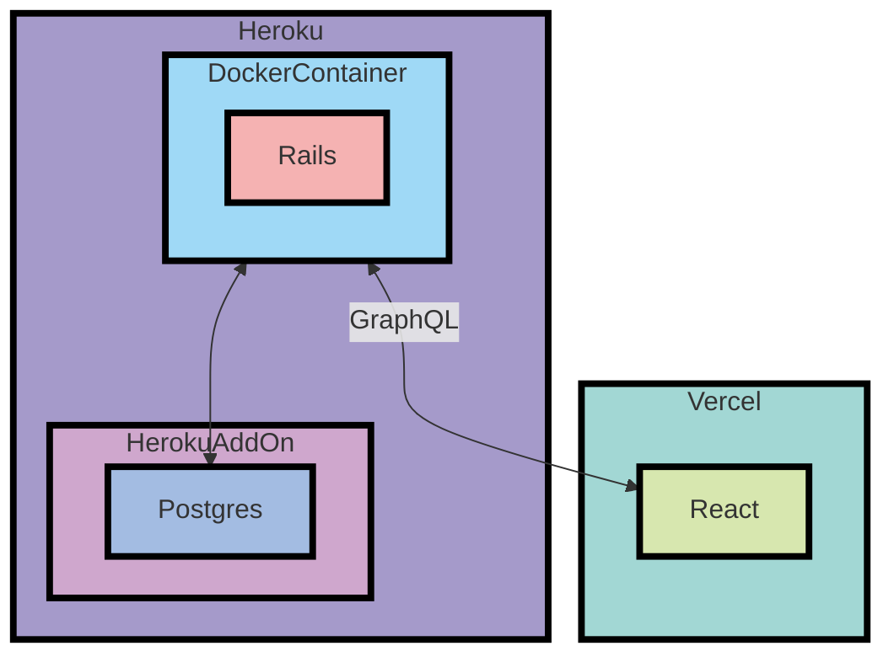

## 名前
Diary

## プロジェクトの概要/目的
このプロジェクトはhoriyuの友人とチーム開発をする目的で作成されました。
友人同士で使う日記アプリです。

## 開発環境の構築方法
`docker-compose up`で起動できるようになっています。

初回起動時のみ、別のターミナルも起動して下記のコマンドを実行してください。
`docker-compose exec api rails db:create`
`docker-compose exec api rails db:migrate`

## 使用方法
工事中
最初に見るべきページや、重要な処理、ドキュメントの解説なども追記します。

## テスト方法
Github Actionsでpushした際に自動テストが実行されるようになっています。
ローカルでの実行方法は工事中です。

## インフラ構成図

